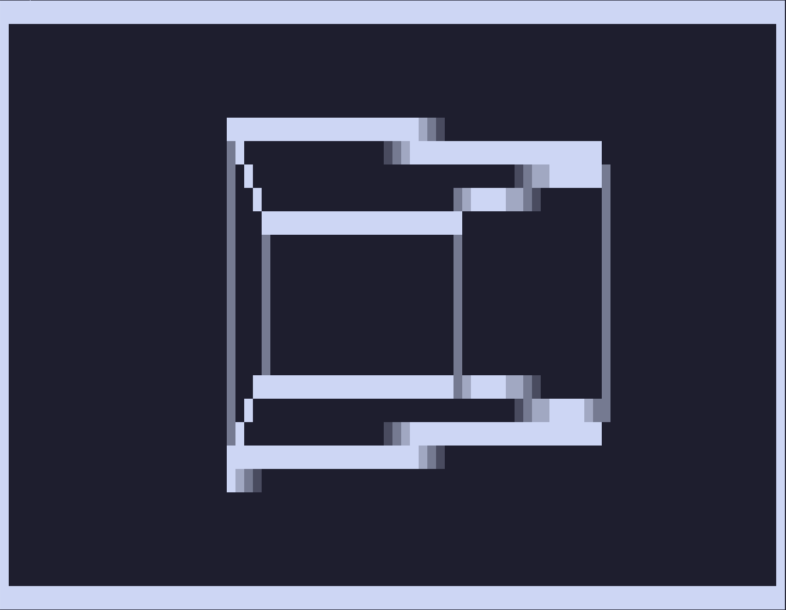

# ASCII Renderer – 3D Rotating Cube

[](https://www.rust-lang.org/)

A minimal–0 dependencies–2D ASCII renderer written in Rust, inspired by [Tsoding’s canvas-based 3D renderer experiment](https://www.youtube.com/watch?v=qjWkNZ0SXfo). This project focuses on rendering a simple 3D wireframe cube directly in the terminal using ASCII characters and 2D projection.



## Features

- Wireframe rendering
- Point plotting
- Simple anti-aliasing for smoother edges

## Roadmap

- [x] Add anti-aliasing
- [ ] Add mesh rendering
- [ ] Optimisation

## Run the project

To run the project simply do

```bash
cargo r -r
```

